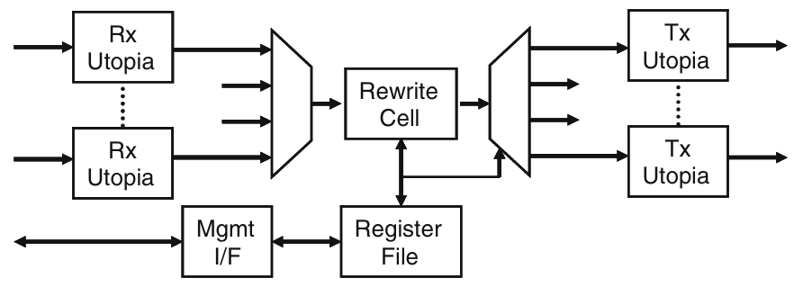
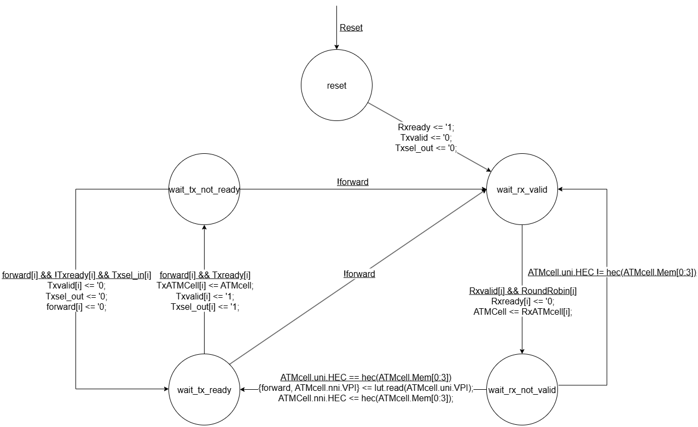
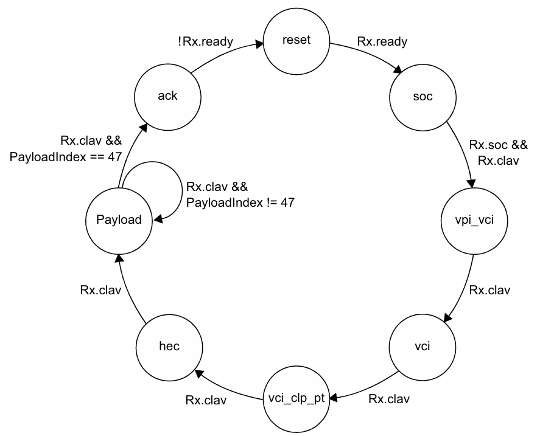
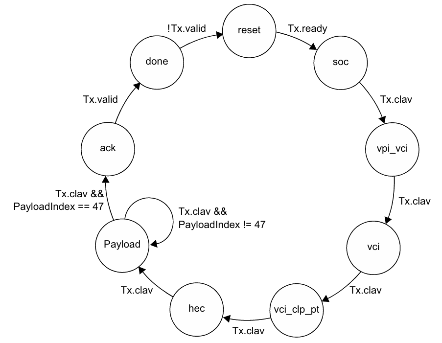
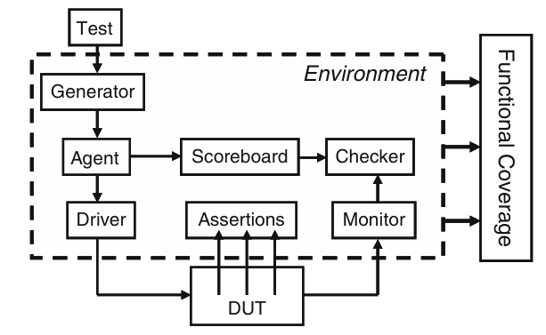
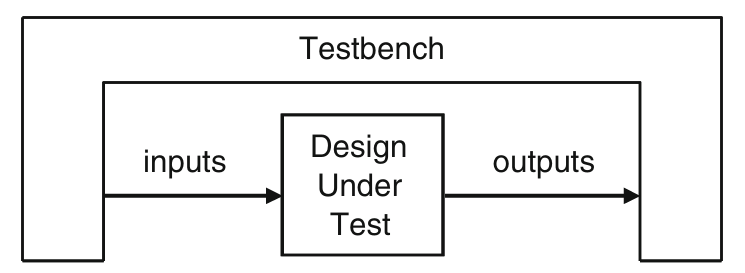

# Asynchronous Transfer Mode (ATM) user-to-network interface and forwarding node

The non-synthesizable behavioral models have been rewritten using the SystemVerilog synthesizable subset.

In addition, the model has been made configurable so that it can easily scaled from a 4x4 quad switch to NxP switch, or any other desired configuration.

## Design
### Data Abstraction
The two ATM formats used in this ATM: the **UNI** format and **UNI** format (4 + 1 + 48 = 53 bytes)

- UNI Cell Format
```
|7           4|3            0|
|GFC          |   VPI_{7-4}  |
|VPI_{3-0}    |   VCI_{15-12}|
|        VCI_{11-4}          |
|VCI_{3-0}    |CLP|    PT    |
|        HEC                 |
|        Payload 0           |
|        ......              |
|        Payload 47          |
```

- NNI Cell Format
```
|7           4|3            0|
|        VPI_{11-4}          |
|VPI_{3-0}    |   VCI_{15-12}|
|        VCI_{11-4}          |
|VCI_{3-0}    |CLP|    PT    |
|        HEC                 |
|        Payload 0           |
|        ......              |
|        Payload 47          |
```

- GFC: Generic Flow Control; For local access control at the user-network interface, usually 0

- VPI: Virtual Path Identifier; Groups many VCs into a Path; used for coarse routing/switching

- VCI: Virtual Channel Identifier; Fine-grained connection ID within a VPI; used for per-connection switching

- CLP: Cell Loss Priority. 0 = high priority (prefer to keep); 1 = low priority (drop first under congestion)

- PT:  Payload Type Indicator; bit 1 (MSB): User Data (0) or Control (1); bit 2: not last segment (0) or is (1); bit 3: not congested (0) or is (1)

- HEC: Header Error Control. CRC-8 over the first 4 header bytes; used for header error detection/correction

These NNI and UNI structures are grouped together as a **union**, which allows a single piece of storage to represent either type of
packet.

The cell for rewriting and forwarding configuration, the length of VPI is same with ATM VPI formats and cpu.Addr
- Cell Configurate Type
```
|`TxPorts+11        12|11                 0|
|FWD                  |VPI                 |
```

### Interface
There are three types: `utopia_if`, `cpu_if`, `lut_if`

In the **utopia** interface, there are following signal components:

- clk_in: input clock used to connect with clocker

- clk_out: output clock used for testbench sampling

- data: main data bus with the adpated bandwith (usually one byte)

- soc: start of cell, pulse high to mark the start of an ATM cell

- en: enable (low-active)

- clav: cell available (low-active), indicates that data is available in FIFO/buffer to read out

- valid: source side asserts when the data bus carries valid information this cycle

- ready: destination side asserts when it is ready to accept data this cycle

- reset: reset internal state machines, counters, FIFO/buffer

- selected: used when multiple devices share a bus, high means this interface is current granted by arbitor (not used in this project)

- ATMcell: ATM Cell Type (a data cell of 53 bytes ), the union of structure for ATM cells (NNI/UNI/Mem)

**CPU** interface has following signal components:

- BusMode: indicate bus cycle type, active-high, 1 indicates CPU master (Tx) Peripheral salve (Rx)

- Addr: peripheral/register file' address (11-bit)

- Sel: chip-select/access enable, active-low, 0 indicates starting access

- DataIn: data of CellCfgType (`TxPorts + 12 bits) sent to CPU

- DataOut: data of CellCfgType sent out from CPU

- Rd_DS: read data strobe, active-low, 0 indicates reading

- Wr_RW: write / read-write, active-low, 0 indicates writing

- Rdy_Dtack: Ready / Data acknowledge, active-low, 0 indicates ack

The **LUT** (look-up table) interface is used in the core of the device called squat, in order to provide a latch-based read/write look-up table.

- Mem: an 256 CellCfgType memory used for squat to look up when forwarding packets

### Top Level - Squat



```
              ---------------
              |    Squat    |
              ---------------
 Rx_Utopia -> | RewriteCell | -> Tx_Utopia
   ...        |     |       |      ...
 Rx_Utopia -> |    LUT      | -> Tx_Utopia
              ---------------
                    ↕
                  CPU_if
```

To deal with the propority of multiple packets forwarding when receiving them from multiple ports, use **round arbitor** to grant.

- The FSM diagram of squat



### Utopia Rx and Tx

- The FSM diagram of Rx




- The FSM diagram of Tx



## TestBench



The **environemnt** includes

- UNI_generator: Generate UNI type transactions.

- mailbox: UNI generator sends genearted transactions to Driver though mailbox

- event: Driver sends acknowledge to generator through event

- Driver: Receive transactions from generator and apply stimuli to the Rx of squat

- Monitor: Mointor the received packages from Tx of squat

- Config: Configure the total number of packets in the environment and the number of packet each Rx port needs to receive

- Scoreboard: Check whether the packets are forwarded and received between squat's Rx and Tx.

- Coverage: Check how many ports are covered during packet forwarding, using cover group and sampling

- vUtopiaRx: Connect to squat's Rx signals

- vUtopiaTx: Connect to squat's Tx signals

- vCPU_T: connect to CPU's peripheral signals

- CPU_driver: Initially configures the LUT table of squat through CPU peripherial bus



To apply random packets, use **transaction** to randomize the data and apply random constraints inside packets, and there are 2 types transactions `UNI_cell` and `NNI_cell` derived from base transaction `BaseTr`

- UNI_cell: the class wrapping up the UNI format data, with additional function converts to NNI_cell type

- NNI_cell: the class wrapping up the NNI format data

There are some different **callbacks** used to build connections between drivers, scoreboards, monitors and coverage

- Scb_Driver_cbs: Callback class connects driver and scoreboard

- Scb_Monitor_cbs: Callback class connects monitor and scoreboard

- Cov_Monitor_cbs: Callback class connects the monitor and coverage

### Top TestBench

This `top.sv` is used to generate clock and reset signals, and connect between interface *utopia_Rx*, interface *utiopia_Tx*, interface *cpu*, moudle *squat* and moudle *test*. 

### Extension

You can add some specific callbacks or additional constraints at `test.sv`. For instance, add `Driver_cbs_drop` class and instantiates it to drop some transactions.

## Simulation

(1) To link src files from `./src` folder and `./tb` folder (you should under folder `./sim`)
```
make link_src
```

(2) To run the simulation
```
make vcs [RAND_SEED=<a_unsigned_integer>]
```
e.g.
```
make vcs RAND_SEED=42
```
if you want to change the `Txports` and `Rxports` definition, you can also modify them inside Makefile 

(3) To see the waveform
```
make visualize
```

(4) To read the coverage reports
```
make urgtxt
```
and the reports will under `./cov_report` folder

(5) To clean up
```
make clean
```
